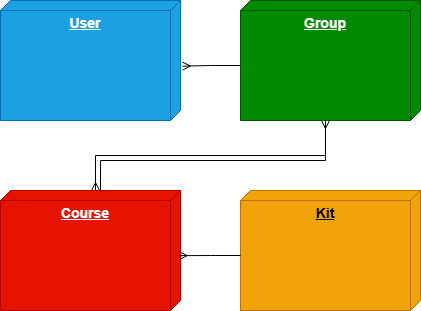

# Robotics School System

## Project Description

A comprehensive web platform developed for a robotics school. It allows administrators, teachers, and students to interact with various educational resources. The system assigns students to specific groups and provides access to courses, each equipped with its respective didactic robotics kit (e.g., StarterKit, Educational Robotics Kit).

## Entity-Relationship (ER) Diagram

_(Nota: Asegúrate de guardar tu imagen del diagrama en la carpeta principal de tu proyecto con el nombre `diagrama.png` o cambia esta ruta al nombre exacto de tu archivo)._
